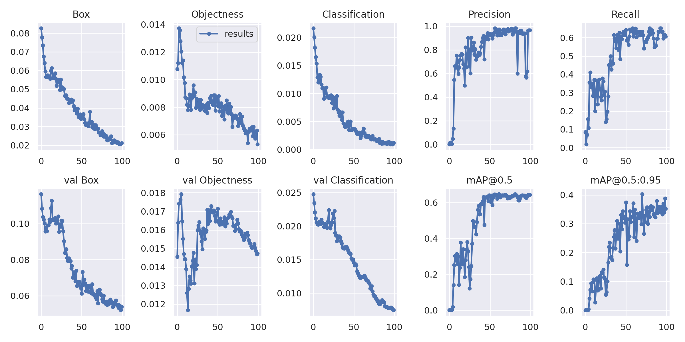

# Safety Helmet Detection
Using Yolov7 I managed to get a weight `best.pt` with **mAP = .64** to detect a safety helmet from a video or an image

# Result


# How To Use
1. Create a virtual environment
   ```bash
   conda create -n yolov7-env
   ```
2. Activate the virtual environment
   ```bash
   conda activate yolov7-env
   ```
3. Install Project Requirements.
   ```bash
   pip install -r requirements.txt
   ```
4. Detect
   - Image
     ```bash
     python detect.py --weights best.pt --img 640 --conf .5 --source "ImagePath.jpg"
     ```
   - Video
     ```bash
     python detect.py --weights best.pt --no-trace --conf .5 --source "videoPath.mp4"
     ```
   - Camera
      ```bash
     python detect.py --weights best.pt --no-trace --conf .5 --source 0
     ```
6. Result will be in `/runs/detect`
---------
# Dataset
- [Roboflow](https://app.roboflow.com/yolovtraining/safety-helmet-waauu/2)

